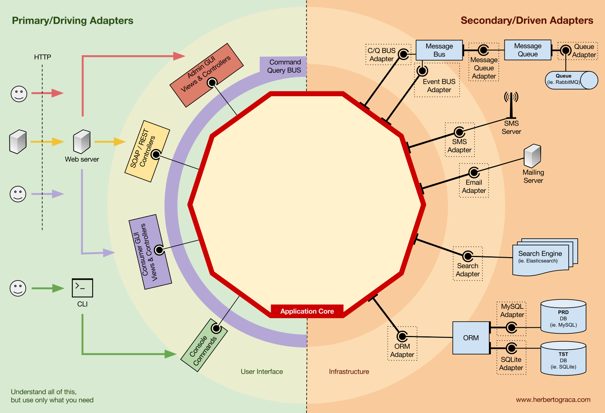

# Task management

## Contexto

Este projeto tem como intuito gerenciar tarefas, utilizamos esse use case para realizar uma implementação de um case que utilize arquitetura hexagonal. 

As funcionalidades presentes nesse projeto são:
- CRUD de categorias
- CRUD de tarefas
- Job para verificar tarefas próximas ao seu tempo de expiração
- Notificações
  - Cadastro de tarefa
  - Alteração de tarefa
  - Lembrete de tarefa próximas ao seu tempo de expiração

## Arquitetura utilizada
Nesse projeto utilizei a Arquitetura Hexagonal que também conhecida como Ports and Adapters, é um padrão arquitetural que visa criar sistemas que são mais flexíveis, testáveis e independentes de tecnologias externas. Essa arquitetura foi introduzida por Alistair Cockburn.

[architecture img ref.](https://herbertograca.com/2017/11/16/explicit-architecture-01-ddd-hexagonal-onion-clean-cqrs-how-i-put-it-all-together/)

A ideia principal é isolar o núcleo da aplicação (regras de negócios) das preocupações externas (interfaces de usuário, bancos de dados, APIs externas, e outros) através de portas e adaptadores.

### Princípios Básicos da Arquitetura Hexagonal
- **Core**: Contém a lógica de negócios e é totalmente independente de qualquer tecnologia externa. Esse núcleo deve ser o mais puro possível, contendo apenas lógica de negócios.
- **Ports**: Interfaces que definem como os elementos externos (como UI, bancos de dados, etc.) interagem com o núcleo da aplicação.
- **Adapters**: Implementações das interfaces definidas nas portas. Eles traduzem chamadas de tecnologias externas para algo que o núcleo da aplicação entende e vice-versa.

## Base de dados

## Tecnologias e frameworks utilizados
- **Kotlin**: Linguagem utilizada para desenvolvimento da aplicação.
- **Spring Boot**: Framework utilizado para simplificar o desenvolvimento de aplicações stand-alone baseadas em Spring.
- **Spring Data JPA**: Utilizado para persistência de dados e mapeamento objeto-relacional.
- **Banco de dados [H2](http://localhost:8080/h2-console)**: Banco de dados em memória utilizado para desenvolvimento e testes.
- **Gradle**: Ferramenta de automação de builds utilizada para gerenciar dependências e tarefas de build.
- **Docker**: Utilizado para containerizar a aplicação, garantindo um ambiente consistente para desenvolvimento e produção.
- **[Actuator (health)](http://localhost:8080/actuator/health)**: Biblioteca utilizada para o health da aplicação.

### Requisitos
- Java 19 ou superior

### Executando a aplicação
1. Clone o repositório
2. Executar a aplicação com o comando `./gradlew build bootRun`
